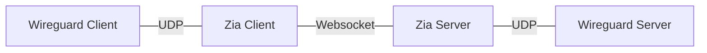
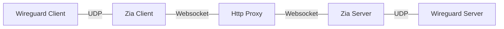

# Zia

Proxy udp over websocket, useful to use Wireguard in restricted networks.

Basic example:



The benefit is that Websocket used Http. If you are in a restricted network where you can only access external services,
if you use a provided Http proxy cou can proxy your Wireguard Udp traffic over Websocket.



## Client

Just download the correct binary from the latest release or use the docker image:

```
ghcr.io/marcelcoding/zia-client
```

Environment variables:

```bash
ZIA_LISTEN_ADDR=127.0.0.1:8080 # local udp listener
ZIA_UPSTREAM=ws://domain.tld:1234 # your zia server instance
# ZIA_PROXY=proxy.tld:8080 # optional http proxy
```

## Server

Just download the correct binary from the latest release or use the docker image:

```
ghcr.io/marcelcoding/zia-server
```

Environment variables:

```bash
ZIA_LISTEN_ADDR=0.0.0.0:1234 # public websocket listener (client -> ZIA_UPSTREAM)
ZIA_UPSTREAM=ws://domain.tld:80 # your actual udp service e.g. wireguard listener
```
